<div align="center">


<br/>



</div>

<br/>

```
┌──(ziad㉿machine)-[~/about-me]
└─$ cat profile.json
```

```json
{
  "name": "Ziad Ali",
  "role": "CS Student",
  "status": "Learning & Building",
  "currently_learning": [
    "Rust",
    "Machine Learning",
    "Deep Learning",
    "Data Structures & Algorithms",
    "Data Science",
    "Systems Programming"
  ],
  "shell": "zsh",
  "editor": "neovim",
  "coffee_level": "critical"
}
```

<br/>

## `$ ls -la ./stack`

<div align="center">


</div>

<br/>

## `$ cat learning_roadmap.md`

<table align="center">
<tr>
<td valign="top" width="50%">

**⚙️ Systems & Low-Level**
- 🦀 Rust — ownership, memory safety, concurrency
- 🖥️ System Programming — OS internals, syscalls
- 📐 DSA — data structures & algorithm design

</td>
<td valign="top" width="50%">

**🧠 AI / Data**
- 🤖 Machine Learning
- 🧬 Deep Learning
- 📊 Data Science — analysis & visualization

</td>
</tr>
</table>

<br/>

## `$ cat status.log`

```diff
+ [OK]      Currently studying Rust ownership & borrowing
+ [OK]      Solving DSA problems daily
~ [BUILD]   Working through ML/DL fundamentals
~ [BUILD]   Exploring OS/systems programming concepts
! [NEXT]    Open to collaborating on systems or ML projects
```

<br/>

## `$ cat contact.sh`

<div align="center">

[](https://github.com/ZeroLayerOS)
[](https://www.linkedin.com/in/ziad-ali-ds/)

</div>

<br/>

<div align="center">

```
$ echo "Thanks for stopping by :)"
> Thanks for stopping by :)
```

<br/>


</div>
