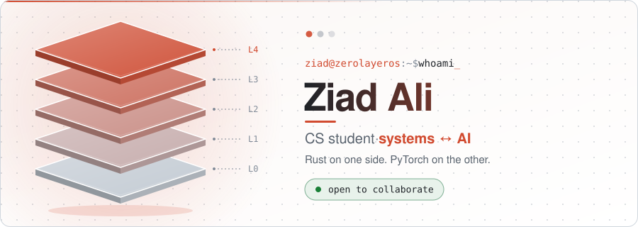
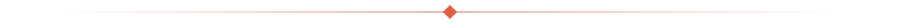
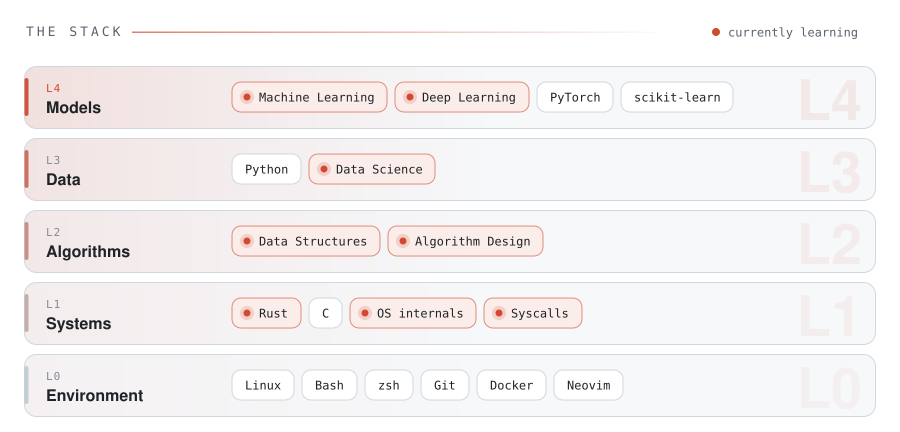

<picture>
  <source media="(prefers-color-scheme: dark)" srcset="./assets/hero-dark.svg">
  <source media="(prefers-color-scheme: light)" srcset="./assets/hero-light.svg">
  
</picture>

 

<picture>
  <source media="(prefers-color-scheme: dark)" srcset="./assets/stack-dark.svg">
  <source media="(prefers-color-scheme: light)" srcset="./assets/stack-light.svg">
  
</picture>

<!--
Projects (add 2-3 lines here once you have repos to point at):

**[project-name](https://github.com/ZeroLayerOS/project-name)** — one sentence: what it does, what you built it with.
-->

<picture>
  <source media="(prefers-color-scheme: dark)" srcset="https://raw.githubusercontent.com/ZeroLayerOS/ZeroLayerOS/output/github-contribution-grid-snake-dark.svg">
  <source media="(prefers-color-scheme: light)" srcset="https://raw.githubusercontent.com/ZeroLayerOS/ZeroLayerOS/output/github-contribution-grid-snake.svg">
  
</picture>

